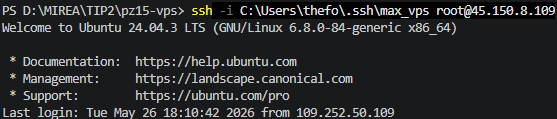
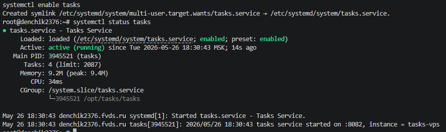
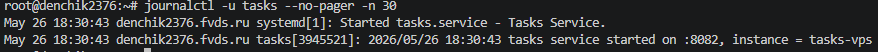
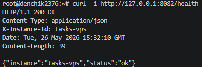
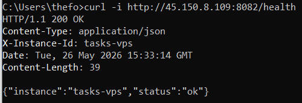
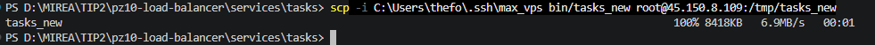
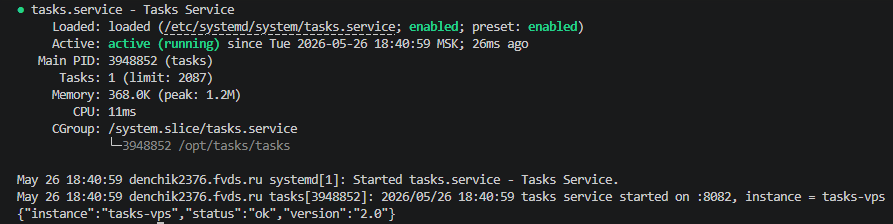
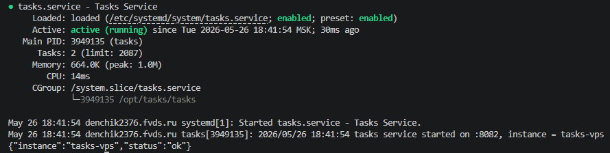

# Практическое занятие №15
# Деплой приложения на VPS. Настройка systemd

**Дисциплина:** Технологии индустриального программирования  
**Семестр:** 2, 2025-2026  
**Студент:** Синицын А.Г. ЭФМО-01-25

---

## Краткое описание проекта

Go-сервис `tasks` (из практики №10) развёрнут на удалённом VPS (спасибо Дену за предоставление :).  
Настроен systemd-сервис с автозапуском, перезапуском при сбоях, вынесенной конфигурацией через env-файл и ограниченным пользователем `tasksuser`.  
Продемонстрированы базовые команды управления, просмотр логов, обновление и откат версии.

---

## Требования к проекту

- VPS на базе Ubuntu/Debian
- Доступ по SSH
- Go 1.21+ (локально для сборки)

---

## Результаты выполнения (скриншоты)

### 1. Подключение по SSH


### 2. Статус сервиса (systemctl status tasks)


### 3. Логи через journalctl


### 4. Health endpoint через curl



### 5. Обновление версии (замена бинарника, добавлено поле 'version: 2.0')



### 6. Откат (возврат старого бинарника)


---

## Процедура обновления и отката

### Обновление версии приложения

1. На локальной машине собрать новый бинарник:
   ```
   GOOS=linux GOARCH=amd64 go build -o bin/tasks_new ./cmd/server
   ```

2. Скопировать его на VPS:
   ```
   scp -i max_vps bin/tasks_new root@<IP>:/tmp/tasks_new
   ```

3. На VPS остановить сервис:
   ```
   systemctl stop tasks
   ```

4. Сохранить старую версию (на случай отката):
   ```
   mv /opt/tasks/tasks /opt/tasks/tasks.old
   ```

5. Переместить новый бинарник:
   ```
   mv /tmp/tasks_new /opt/tasks/tasks
   ```

6. Назначить владельца и права:
   ```
   chown tasksuser:tasksuser /opt/tasks/tasks
   chmod 755 /opt/tasks/tasks
   ```

7. Запустить сервис:
   ```
   systemctl start tasks
   ```

8. Проверить статус и доступность:
   ```
   systemctl status tasks
   curl http://127.0.0.1:8082/health
   ```

### Откат версии (при неудачном обновлении)

1. Остановить сервис:
   ```
   systemctl stop tasks
   ```

2. Вернуть старый бинарник:
   ```
   mv /opt/tasks/tasks.old /opt/tasks/tasks
   ```

3. Запустить сервис:
   ```
   systemctl start tasks
   ```

4. Проверить работоспособность:
   ```
   systemctl status tasks
   curl http://127.0.0.1:8082/health
   ```

---

## Ответы на контрольные вопросы

**1. Что такое VPS и зачем он нужен backend-разработчику?**  
VPS (Virtual Private Server) – виртуальный сервер, на котором можно запускать собственные приложения. Он нужен для публикации сервисов в сети, обеспечения постоянной работы и отделения среды разработки от среды эксплуатации.

**2. Почему запуск приложения на VPS отличается от локального запуска на компьютере разработчика?**  
На VPS требуется настройка systemd, автозапуска, прав доступа, переменных окружения, а также обеспечение доступности сервиса после перезагрузки. Локальный запуск обычно не требует этих шагов.

**3. Для чего используется systemd?**  
Systemd – система инициализации и управления службами. Позволяет запускать сервисы при старте сервера, перезапускать их при сбоях, просматривать состояние и логи.

**4. Почему не рекомендуется запускать серверное приложение от root?**  
Из-за рисков: ошибка в приложении может повлиять на всю систему, при компрометации злоумышленник получает максимальные права, усложняется разделение ответственности.

**5. Зачем выносить конфигурацию в отдельный env-файл?**  
Чтобы менять параметры без перекомпиляции, не хранить секреты в репозитории, использовать один бинарник в разных средах, упростить обновление и поддержку.

**6. Что делает параметр Restart=always?**  
Обеспечивает автоматический перезапуск сервиса при его аварийном завершении (падении).

**7. Для чего нужен EnvironmentFile в unit-файле?**  
Для загрузки переменных окружения из внешнего файла, что позволяет изолировать конфигурацию от unit-файла.

**8. Как проверить состояние службы через systemctl?**  
`systemctl status tasks` – показывает активна ли служба, PID, последние логи.

**9. Как посмотреть логи сервиса через journalctl?**  
`journalctl -u tasks -n 50` – последние 50 строк, `journalctl -u tasks -f` – слежение в реальном времени.

**10. Что нужно сделать перед обновлением unit-файла systemd?**  
Выполнить `systemctl daemon-reload`, чтобы systemd перечитал конфигурацию.

**11. Почему полезно иметь процедуру отката версии?**  
Чтобы быстро восстановить работоспособность при неудачном обновлении, не тратя время на поиск ошибок.

**12. Зачем в реальных системах часто используют NGINX перед приложением?**  
Для обеспечения безопасности, SSL-терминации, балансировки нагрузки, кэширования и удобства управления портами (80/443 наружу, а приложение на внутреннем порту).
